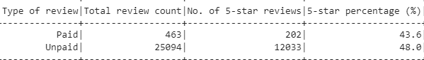

# Amazon Vine analysis

## Overview
This project used Amazon product [reviews data](https://s3.amazonaws.com/amazon-reviews-pds/tsv/index.txt) to assess whether paid reviews are more likely to be 5 stars 
than unpaid reviews. For our purposes, "paid" reviews were those that were submitted under the Amazon Vine program. Sellers do not pay directly for these 
reviews; however they are paid in the sense that the reviewers receive free products in exchange for their honest reviews. Amazon Vine is an invitation-only program run 
by Amazon, which says it invites reviewers to join the program based on their history of providing insightful product reviews.

For this analysis, I used reviews of baby products on Amazon.

I first filtered the data to include only reviews that received at least 20 votes by other Amazon customers and that had at least half of those votes deem the review 
helpful.

## Results
My analysis found that paid reviews, meaning those submitted through the Amazon Vine program, are less likely to be 5 stars. 
- Nearly half, or 48.0%, of non-Vine reviews are 5 stars, while about 43.6% of Vine reviews are 5 stars.
- There is a relatively small sample size for Vine reviews of baby products, at 463, with 202 of those being 5-star reviews.
- The vast majority of baby product reviews were unpaid, at 25,094. Of those, 12,033 were 5-star reviews. 

## Summary
There does not appear to be a bias toward positivity in the Amazon Vine program, at least based on a review of 5-star ratings of baby products. This analysis found 
that Amazon Vine reviewers were less likely than others to award 5 stars. 

Given the invitation-only nature of the Vine program and the incentive to remain in this program, given the possibility of receiving free products, it is perhaps not 
surprising that Vine reviewers are not overly free with 5-star reviews. In fact, one could argue that there is an incentive to avoid being overly positive in one's 
reviews, for fear of being kicked out of the program. With that in mind, it could be interesting to look at the distribution of positive reviews (those with 4 or 5 
stars), neutral reviews (those with 3 stars), and negative reviews (those with 1 or 2 stars), to see if there is a negativity bias in the Vine program.
